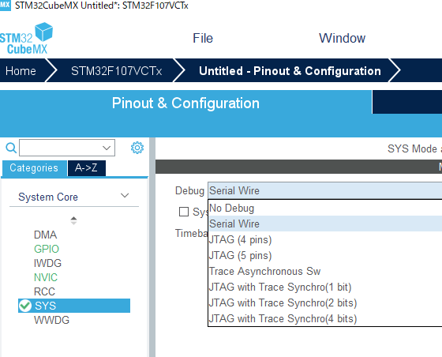

STM32集成开发环境设置
=====================

STM32官方开发环境由两部分软件，互相配合使用

* STM32CubeMX

提供基于 芯片/开发板/示例 的配置组件，可以方便的配置模块，时钟，管脚使用，相关的UI界面友好，方便确认和检查冲突。最终可以生成基于不同开发环境的
代码工程文件(夹)。

* STM32CubeIDE

基于Eclipse的开发环境，提供远程调试，和下载器连接等集成模块。

新建开发环境
------------

    使用STM32CubeMX开始基于MPU的工程文件框架

选择基于MPU的工程设计

选择F107
""""""""

配置管脚及逻辑模块
------------------

配置DEBUG选项
"""""""""""""

    使用SWD调试程序。
    开发板连接自带的ST-Link使用外部连接模式。

使用外部时钟
""""""""""""

外部始终是独立部件，较内部始终稳定，并且更高速，板载(HSE)高速振荡器25M

.. figure:: image_/enable_external_hse_20231126.png
    :scale: 50%
    :align: center

使用UART2
"""""""""

    UART2与ST-Link的调试Com口相连，可以直接受用ST-Link的COM设备输出通信

时钟的配置
----------

MX的非常方便和友好的功能就是时钟配置
尤其是配置外部时钟，使用“Resolve Clock Issues”倒算，可以简单得到最大时钟配置

    外部时钟源修改为25MHz
    单击“Enable CSS”
    单击“Resolve Clock Issues”

MPU时钟调整为72MHz
""""""""""""""""""

管脚配置确认
------------

配置Project并生成代码
---------------------

    代码生成完成

    文件确认

在IDE中导入工程文件
-------------------

    项目文件完成导入

编辑代码
--------

使用TTL/UART2作为printf的输出

| 代码加入至 `/* USER CODE ... */` 之间
| 在改动MX设计和配置之后,*USER CODE*间的代码可以保留

.. code-block:: c
    :linenos:
    :lineno-start: 56
    :name: printf putchar implementation
    :emphasize-lines: 2,7

    /* Private user code ---------------------------------------------------------*/
    /* USER CODE BEGIN 0 */
    int __io_putchar(int ch) {
        HAL_UART_Transmit(&huart2, (uint8_t*) &ch, 1, HAL_MAX_DELAY);
        return ch;
    }
    /* USER CODE END 0 */

Build
-----

.. code-block:: shell
    :linenos:

    13:30:01 **** Build of configuration Debug for project procuartonly ****
    make -j4 all
    
    arm-none-eabi-gcc "../Drivers/STM32F1xx_HAL_Driver/Src/stm32f1xx_hal.c" -mcpu=cortex-m3 -std=gnu11 -g3 -DDEBUG -DUSE_HAL_DRIVER -DSTM32F107xC -c -I../Core/Inc -I../Drivers/STM32F1xx_HAL_Driver/Inc -I../Drivers/STM32F1xx_HAL_Driver/Inc/Legacy -I../Drivers/CMSIS/Device/ST/STM32F1xx/Include -I../Drivers/CMSIS/Include -O0 -ffunction-sections -fdata-sections -Wall -fstack-usage -MMD -MP -MF"Drivers/STM32F1xx_HAL_Driver/Src/stm32f1xx_hal.d" -MT"Drivers/STM32F1xx_HAL_Driver/Src/stm32f1xx_hal.o" --specs=nano.specs -mfloat-abi=soft -mthumb -o "Drivers/STM32F1xx_HAL_Driver/Src/stm32f1xx_hal.o"
    arm-none-eabi-gcc "../Drivers/STM32F1xx_HAL_Driver/Src/stm32f1xx_hal_cortex.c" -mcpu=cortex-m3 -std=gnu11 -g3 -DDEBUG -DUSE_HAL_DRIVER -DSTM32F107xC -c -I../Core/Inc -I../Drivers/STM32F1xx_HAL_Driver/Inc -I../Drivers/STM32F1xx_HAL_Driver/Inc/Legacy -I../Drivers/CMSIS/Device/ST/STM32F1xx/Include -I../Drivers/CMSIS/Include -O0 -ffunction-sections -fdata-sections -Wall -fstack-usage -MMD -MP -MF"Drivers/STM32F1xx_HAL_Driver/Src/stm32f1xx_hal_cortex.d" -MT"Drivers/STM32F1xx_HAL_Driver/Src/stm32f1xx_hal_cortex.o" --specs=nano.specs -mfloat-abi=soft -mthumb -o "Drivers/STM32F1xx_HAL_Driver/Src/stm32f1xx_hal_cortex.o"
    arm-none-eabi-gcc "../Drivers/STM32F1xx_HAL_Driver/Src/stm32f1xx_hal_dma.c" -mcpu=cortex-m3 -std=gnu11 -g3 -DDEBUG -DUSE_HAL_DRIVER -DSTM32F107xC -c -I../Core/Inc -I../Drivers/STM32F1xx_HAL_Driver/Inc -I../Drivers/STM32F1xx_HAL_Driver/Inc/Legacy -I../Drivers/CMSIS/Device/ST/STM32F1xx/Include -I../Drivers/CMSIS/Include -O0 -ffunction-sections -fdata-sections -Wall -fstack-usage -MMD -MP -MF"Drivers/STM32F1xx_HAL_Driver/Src/stm32f1xx_hal_dma.d" -MT"Drivers/STM32F1xx_HAL_Driver/Src/stm32f1xx_hal_dma.o" --specs=nano.specs -mfloat-abi=soft -mthumb -o "Drivers/STM32F1xx_HAL_Driver/Src/stm32f1xx_hal_dma.o"
    arm-none-eabi-gcc "../Drivers/STM32F1xx_HAL_Driver/Src/stm32f1xx_hal_exti.c" -mcpu=cortex-m3 -std=gnu11 -g3 -DDEBUG -DUSE_HAL_DRIVER -DSTM32F107xC -c -I../Core/Inc -I../Drivers/STM32F1xx_HAL_Driver/Inc -I../Drivers/STM32F1xx_HAL_Driver/Inc/Legacy -I../Drivers/CMSIS/Device/ST/STM32F1xx/Include -I../Drivers/CMSIS/Include -O0 -ffunction-sections -fdata-sections -Wall -fstack-usage -MMD -MP -MF"Drivers/STM32F1xx_HAL_Driver/Src/stm32f1xx_hal_exti.d" -MT"Drivers/STM32F1xx_HAL_Driver/Src/stm32f1xx_hal_exti.o" --specs=nano.specs -mfloat-abi=soft -mthumb -o "Drivers/STM32F1xx_HAL_Driver/Src/stm32f1xx_hal_exti.o"
    arm-none-eabi-gcc "../Drivers/STM32F1xx_HAL_Driver/Src/stm32f1xx_hal_flash.c" -mcpu=cortex-m3 -std=gnu11 -g3 -DDEBUG -DUSE_HAL_DRIVER -DSTM32F107xC -c -I../Core/Inc -I../Drivers/STM32F1xx_HAL_Driver/Inc -I../Drivers/STM32F1xx_HAL_Driver/Inc/Legacy -I../Drivers/CMSIS/Device/ST/STM32F1xx/Include -I../Drivers/CMSIS/Include -O0 -ffunction-sections -fdata-sections -Wall -fstack-usage -MMD -MP -MF"Drivers/STM32F1xx_HAL_Driver/Src/stm32f1xx_hal_flash.d" -MT"Drivers/STM32F1xx_HAL_Driver/Src/stm32f1xx_hal_flash.o" --specs=nano.specs -mfloat-abi=soft -mthumb -o "Drivers/STM32F1xx_HAL_Driver/Src/stm32f1xx_hal_flash.o"
    arm-none-eabi-gcc "../Drivers/STM32F1xx_HAL_Driver/Src/stm32f1xx_hal_flash_ex.c" -mcpu=cortex-m3 -std=gnu11 -g3 -DDEBUG -DUSE_HAL_DRIVER -DSTM32F107xC -c -I../Core/Inc -I../Drivers/STM32F1xx_HAL_Driver/Inc -I../Drivers/STM32F1xx_HAL_Driver/Inc/Legacy -I../Drivers/CMSIS/Device/ST/STM32F1xx/Include -I../Drivers/CMSIS/Include -O0 -ffunction-sections -fdata-sections -Wall -fstack-usage -MMD -MP -MF"Drivers/STM32F1xx_HAL_Driver/Src/stm32f1xx_hal_flash_ex.d" -MT"Drivers/STM32F1xx_HAL_Driver/Src/stm32f1xx_hal_flash_ex.o" --specs=nano.specs -mfloat-abi=soft -mthumb -o "Drivers/STM32F1xx_HAL_Driver/Src/stm32f1xx_hal_flash_ex.o"
    arm-none-eabi-gcc "../Drivers/STM32F1xx_HAL_Driver/Src/stm32f1xx_hal_gpio.c" -mcpu=cortex-m3 -std=gnu11 -g3 -DDEBUG -DUSE_HAL_DRIVER -DSTM32F107xC -c -I../Core/Inc -I../Drivers/STM32F1xx_HAL_Driver/Inc -I../Drivers/STM32F1xx_HAL_Driver/Inc/Legacy -I../Drivers/CMSIS/Device/ST/STM32F1xx/Include -I../Drivers/CMSIS/Include -O0 -ffunction-sections -fdata-sections -Wall -fstack-usage -MMD -MP -MF"Drivers/STM32F1xx_HAL_Driver/Src/stm32f1xx_hal_gpio.d" -MT"Drivers/STM32F1xx_HAL_Driver/Src/stm32f1xx_hal_gpio.o" --specs=nano.specs -mfloat-abi=soft -mthumb -o "Drivers/STM32F1xx_HAL_Driver/Src/stm32f1xx_hal_gpio.o"
    arm-none-eabi-gcc "../Drivers/STM32F1xx_HAL_Driver/Src/stm32f1xx_hal_gpio_ex.c" -mcpu=cortex-m3 -std=gnu11 -g3 -DDEBUG -DUSE_HAL_DRIVER -DSTM32F107xC -c -I../Core/Inc -I../Drivers/STM32F1xx_HAL_Driver/Inc -I../Drivers/STM32F1xx_HAL_Driver/Inc/Legacy -I../Drivers/CMSIS/Device/ST/STM32F1xx/Include -I../Drivers/CMSIS/Include -O0 -ffunction-sections -fdata-sections -Wall -fstack-usage -MMD -MP -MF"Drivers/STM32F1xx_HAL_Driver/Src/stm32f1xx_hal_gpio_ex.d" -MT"Drivers/STM32F1xx_HAL_Driver/Src/stm32f1xx_hal_gpio_ex.o" --specs=nano.specs -mfloat-abi=soft -mthumb -o "Drivers/STM32F1xx_HAL_Driver/Src/stm32f1xx_hal_gpio_ex.o"
    arm-none-eabi-gcc "../Drivers/STM32F1xx_HAL_Driver/Src/stm32f1xx_hal_pwr.c" -mcpu=cortex-m3 -std=gnu11 -g3 -DDEBUG -DUSE_HAL_DRIVER -DSTM32F107xC -c -I../Core/Inc -I../Drivers/STM32F1xx_HAL_Driver/Inc -I../Drivers/STM32F1xx_HAL_Driver/Inc/Legacy -I../Drivers/CMSIS/Device/ST/STM32F1xx/Include -I../Drivers/CMSIS/Include -O0 -ffunction-sections -fdata-sections -Wall -fstack-usage -MMD -MP -MF"Drivers/STM32F1xx_HAL_Driver/Src/stm32f1xx_hal_pwr.d" -MT"Drivers/STM32F1xx_HAL_Driver/Src/stm32f1xx_hal_pwr.o" --specs=nano.specs -mfloat-abi=soft -mthumb -o "Drivers/STM32F1xx_HAL_Driver/Src/stm32f1xx_hal_pwr.o"
    arm-none-eabi-gcc "../Drivers/STM32F1xx_HAL_Driver/Src/stm32f1xx_hal_rcc.c" -mcpu=cortex-m3 -std=gnu11 -g3 -DDEBUG -DUSE_HAL_DRIVER -DSTM32F107xC -c -I../Core/Inc -I../Drivers/STM32F1xx_HAL_Driver/Inc -I../Drivers/STM32F1xx_HAL_Driver/Inc/Legacy -I../Drivers/CMSIS/Device/ST/STM32F1xx/Include -I../Drivers/CMSIS/Include -O0 -ffunction-sections -fdata-sections -Wall -fstack-usage -MMD -MP -MF"Drivers/STM32F1xx_HAL_Driver/Src/stm32f1xx_hal_rcc.d" -MT"Drivers/STM32F1xx_HAL_Driver/Src/stm32f1xx_hal_rcc.o" --specs=nano.specs -mfloat-abi=soft -mthumb -o "Drivers/STM32F1xx_HAL_Driver/Src/stm32f1xx_hal_rcc.o"
    arm-none-eabi-gcc "../Drivers/STM32F1xx_HAL_Driver/Src/stm32f1xx_hal_rcc_ex.c" -mcpu=cortex-m3 -std=gnu11 -g3 -DDEBUG -DUSE_HAL_DRIVER -DSTM32F107xC -c -I../Core/Inc -I../Drivers/STM32F1xx_HAL_Driver/Inc -I../Drivers/STM32F1xx_HAL_Driver/Inc/Legacy -I../Drivers/CMSIS/Device/ST/STM32F1xx/Include -I../Drivers/CMSIS/Include -O0 -ffunction-sections -fdata-sections -Wall -fstack-usage -MMD -MP -MF"Drivers/STM32F1xx_HAL_Driver/Src/stm32f1xx_hal_rcc_ex.d" -MT"Drivers/STM32F1xx_HAL_Driver/Src/stm32f1xx_hal_rcc_ex.o" --specs=nano.specs -mfloat-abi=soft -mthumb -o "Drivers/STM32F1xx_HAL_Driver/Src/stm32f1xx_hal_rcc_ex.o"
    arm-none-eabi-gcc "../Drivers/STM32F1xx_HAL_Driver/Src/stm32f1xx_hal_tim.c" -mcpu=cortex-m3 -std=gnu11 -g3 -DDEBUG -DUSE_HAL_DRIVER -DSTM32F107xC -c -I../Core/Inc -I../Drivers/STM32F1xx_HAL_Driver/Inc -I../Drivers/STM32F1xx_HAL_Driver/Inc/Legacy -I../Drivers/CMSIS/Device/ST/STM32F1xx/Include -I../Drivers/CMSIS/Include -O0 -ffunction-sections -fdata-sections -Wall -fstack-usage -MMD -MP -MF"Drivers/STM32F1xx_HAL_Driver/Src/stm32f1xx_hal_tim.d" -MT"Drivers/STM32F1xx_HAL_Driver/Src/stm32f1xx_hal_tim.o" --specs=nano.specs -mfloat-abi=soft -mthumb -o "Drivers/STM32F1xx_HAL_Driver/Src/stm32f1xx_hal_tim.o"
    arm-none-eabi-gcc "../Drivers/STM32F1xx_HAL_Driver/Src/stm32f1xx_hal_tim_ex.c" -mcpu=cortex-m3 -std=gnu11 -g3 -DDEBUG -DUSE_HAL_DRIVER -DSTM32F107xC -c -I../Core/Inc -I../Drivers/STM32F1xx_HAL_Driver/Inc -I../Drivers/STM32F1xx_HAL_Driver/Inc/Legacy -I../Drivers/CMSIS/Device/ST/STM32F1xx/Include -I../Drivers/CMSIS/Include -O0 -ffunction-sections -fdata-sections -Wall -fstack-usage -MMD -MP -MF"Drivers/STM32F1xx_HAL_Driver/Src/stm32f1xx_hal_tim_ex.d" -MT"Drivers/STM32F1xx_HAL_Driver/Src/stm32f1xx_hal_tim_ex.o" --specs=nano.specs -mfloat-abi=soft -mthumb -o "Drivers/STM32F1xx_HAL_Driver/Src/stm32f1xx_hal_tim_ex.o"
    arm-none-eabi-gcc "../Drivers/STM32F1xx_HAL_Driver/Src/stm32f1xx_hal_uart.c" -mcpu=cortex-m3 -std=gnu11 -g3 -DDEBUG -DUSE_HAL_DRIVER -DSTM32F107xC -c -I../Core/Inc -I../Drivers/STM32F1xx_HAL_Driver/Inc -I../Drivers/STM32F1xx_HAL_Driver/Inc/Legacy -I../Drivers/CMSIS/Device/ST/STM32F1xx/Include -I../Drivers/CMSIS/Include -O0 -ffunction-sections -fdata-sections -Wall -fstack-usage -MMD -MP -MF"Drivers/STM32F1xx_HAL_Driver/Src/stm32f1xx_hal_uart.d" -MT"Drivers/STM32F1xx_HAL_Driver/Src/stm32f1xx_hal_uart.o" --specs=nano.specs -mfloat-abi=soft -mthumb -o "Drivers/STM32F1xx_HAL_Driver/Src/stm32f1xx_hal_uart.o"
    arm-none-eabi-gcc -mcpu=cortex-m3 -g3 -DDEBUG -c -x assembler-with-cpp -MMD -MP -MF"Core/Startup/startup_stm32f107vctx.d" -MT"Core/Startup/startup_stm32f107vctx.o" --specs=nano.specs -mfloat-abi=soft -mthumb -o "Core/Startup/startup_stm32f107vctx.o" "../Core/Startup/startup_stm32f107vctx.s"
    arm-none-eabi-gcc "../Core/Src/main.c" -mcpu=cortex-m3 -std=gnu11 -g3 -DDEBUG -DUSE_HAL_DRIVER -DSTM32F107xC -c -I../Core/Inc -I../Drivers/STM32F1xx_HAL_Driver/Inc -I../Drivers/STM32F1xx_HAL_Driver/Inc/Legacy -I../Drivers/CMSIS/Device/ST/STM32F1xx/Include -I../Drivers/CMSIS/Include -O0 -ffunction-sections -fdata-sections -Wall -fstack-usage -MMD -MP -MF"Core/Src/main.d" -MT"Core/Src/main.o" --specs=nano.specs -mfloat-abi=soft -mthumb -o "Core/Src/main.o"
    arm-none-eabi-gcc "../Core/Src/stm32f1xx_hal_msp.c" -mcpu=cortex-m3 -std=gnu11 -g3 -DDEBUG -DUSE_HAL_DRIVER -DSTM32F107xC -c -I../Core/Inc -I../Drivers/STM32F1xx_HAL_Driver/Inc -I../Drivers/STM32F1xx_HAL_Driver/Inc/Legacy -I../Drivers/CMSIS/Device/ST/STM32F1xx/Include -I../Drivers/CMSIS/Include -O0 -ffunction-sections -fdata-sections -Wall -fstack-usage -MMD -MP -MF"Core/Src/stm32f1xx_hal_msp.d" -MT"Core/Src/stm32f1xx_hal_msp.o" --specs=nano.specs -mfloat-abi=soft -mthumb -o "Core/Src/stm32f1xx_hal_msp.o"
    arm-none-eabi-gcc "../Core/Src/stm32f1xx_it.c" -mcpu=cortex-m3 -std=gnu11 -g3 -DDEBUG -DUSE_HAL_DRIVER -DSTM32F107xC -c -I../Core/Inc -I../Drivers/STM32F1xx_HAL_Driver/Inc -I../Drivers/STM32F1xx_HAL_Driver/Inc/Legacy -I../Drivers/CMSIS/Device/ST/STM32F1xx/Include -I../Drivers/CMSIS/Include -O0 -ffunction-sections -fdata-sections -Wall -fstack-usage -MMD -MP -MF"Core/Src/stm32f1xx_it.d" -MT"Core/Src/stm32f1xx_it.o" --specs=nano.specs -mfloat-abi=soft -mthumb -o "Core/Src/stm32f1xx_it.o"
    arm-none-eabi-gcc "../Core/Src/syscalls.c" -mcpu=cortex-m3 -std=gnu11 -g3 -DDEBUG -DUSE_HAL_DRIVER -DSTM32F107xC -c -I../Core/Inc -I../Drivers/STM32F1xx_HAL_Driver/Inc -I../Drivers/STM32F1xx_HAL_Driver/Inc/Legacy -I../Drivers/CMSIS/Device/ST/STM32F1xx/Include -I../Drivers/CMSIS/Include -O0 -ffunction-sections -fdata-sections -Wall -fstack-usage -MMD -MP -MF"Core/Src/syscalls.d" -MT"Core/Src/syscalls.o" --specs=nano.specs -mfloat-abi=soft -mthumb -o "Core/Src/syscalls.o"
    arm-none-eabi-gcc "../Core/Src/sysmem.c" -mcpu=cortex-m3 -std=gnu11 -g3 -DDEBUG -DUSE_HAL_DRIVER -DSTM32F107xC -c -I../Core/Inc -I../Drivers/STM32F1xx_HAL_Driver/Inc -I../Drivers/STM32F1xx_HAL_Driver/Inc/Legacy -I../Drivers/CMSIS/Device/ST/STM32F1xx/Include -I../Drivers/CMSIS/Include -O0 -ffunction-sections -fdata-sections -Wall -fstack-usage -MMD -MP -MF"Core/Src/sysmem.d" -MT"Core/Src/sysmem.o" --specs=nano.specs -mfloat-abi=soft -mthumb -o "Core/Src/sysmem.o"
    arm-none-eabi-gcc "../Core/Src/system_stm32f1xx.c" -mcpu=cortex-m3 -std=gnu11 -g3 -DDEBUG -DUSE_HAL_DRIVER -DSTM32F107xC -c -I../Core/Inc -I../Drivers/STM32F1xx_HAL_Driver/Inc -I../Drivers/STM32F1xx_HAL_Driver/Inc/Legacy -I../Drivers/CMSIS/Device/ST/STM32F1xx/Include -I../Drivers/CMSIS/Include -O0 -ffunction-sections -fdata-sections -Wall -fstack-usage -MMD -MP -MF"Core/Src/system_stm32f1xx.d" -MT"Core/Src/system_stm32f1xx.o" --specs=nano.specs -mfloat-abi=soft -mthumb -o "Core/Src/system_stm32f1xx.o"
    arm-none-eabi-gcc -o "procuartonly.elf" @"objects.list"   -mcpu=cortex-m3 -T"F:\development\simpleboardproc\procuartonly\STM32F107VCTX_FLASH.ld" --specs=nosys.specs -Wl,-Map="procuartonly.map" -Wl,--gc-sections -static --specs=nano.specs -mfloat-abi=soft -mthumb -Wl,--start-group -lc -lm -Wl,--end-group
    Finished building target: procuartonly.elf
 
    arm-none-eabi-size   procuartonly.elf 
    arm-none-eabi-objdump -h -S  procuartonly.elf  > "procuartonly.list"
       text	   data	    bss	    dec	    hex	filename
       6812	     20	   1644	   8476	   211c	procuartonly.elf
    Finished building: default.size.stdout
 
    Finished building: procuartonly.list
 

    13:30:07 Build Finished. 0 errors, 0 warnings. (took 5s.601ms)

OpenOCD Setup
=============

Start Deamon
------------

.. code-block::

    openocd -c 'adapter driver hla' -c 'hla_layout stlink' -c 'bindto 0.0.0.0' -c 'hla_vid_pid 0x0483 0x374b' -c 'transport select hla_swd' -c 'reset_config trst_and_srst' -f /usr/share/openocd/scripts/target/stm32f1x.cfg

.. code-block:: output

    Open On-Chip Debugger 0.11.0-rc2
    Licensed under GNU GPL v2
    For bug reports, read
            http://openocd.org/doc/doxygen/bugs.html
    hla_swd
    trst_and_srst separate srst_gates_jtag trst_push_pull srst_open_drain connect_deassert_srst

    Info : The selected transport took over low-level target control. The results might differ compared to plain JTAG/SWD
    Info : Listening on port 6666 for tcl connections
    Info : Listening on port 4444 for telnet connections
    Info : clock speed 1000 kHz
    Info : STLINK V2J39M27 (API v2) VID:PID 0483:374B
    Info : Target voltage: 0.001574
    Error: target voltage may be too low for reliable debugging
    Info : stm32f1x.cpu: hardware has 6 breakpoints, 4 watchpoints
    Info : starting gdb server for stm32f1x.cpu on 3333
    Info : Listening on port 3333 for gdb connections

On-site Debug
-------------

.. code-block:: text
    :emphasize-lines: 1,7,10

    $ telnet localhost 4444
    Trying ::1...
    Trying 127.0.0.1...
    Connected to localhost.
    Escape character is '^]'.
    Open On-Chip Debugger
    > halt
    target halted due to debug-request, current mode: Thread
    xPSR: 0x21000000 pc: 0x08003062 msp: 0x2000fe20
    > reg
    ===== arm v7m registers
    (0) r0 (/32): 0x20000138
    (1) r1 (/32): 0x00000040
    (2) r2 (/32): 0x00000000
    (3) r3 (/32): 0x00000000
    (4) r4 (/32): 0x20000010
    (5) r5 (/32): 0x200001d8
    (6) r6 (/32): 0x00000034
    (7) r7 (/32): 0x2000fe20
    (8) r8 (/32): 0x0800452c
    (9) r9 (/32): 0x00000001
    (10) r10 (/32): 0x0800448e
    (11) r11 (/32): 0x00000003
    (12) r12 (/32): 0x08003e8f
    (13) sp (/32): 0x2000fe20
    (14) lr (/32): 0x08002a03
    (15) pc (/32): 0x08003062
    (16) xPSR (/32): 0x21000000
    (17) msp (/32): 0x2000fe20
    (18) psp (/32): 0xb0462400
    (20) primask (/1): 0x00
    (21) basepri (/8): 0x00
    (22) faultmask (/1): 0x00
    (23) control (/3): 0x00
    ===== Cortex-M DWT registers

Connect local TTL (ST-Link)
---------------------------

.. code-block:: shell

    $ minicom -D /dev/ttyACM0 -t linux

.. code-block:: output

    loop output message
    loop output message
    loop output message
    loop output message
    loop output message
    loop output message
    loop output message
    loop output message
    loop output message
    loop output message
    loop output message
    loop output message
    loop output message
    loop output message
    loop output message
    loop output message
    loop output message
    loop o
    CTRL-A Z for help | 115200 8N1 | NOR | Minicom 2.8 | VT102 | Offline | ttyACM0

CTRL-A --> X | Exit minicom

Remote Debug Profile
====================

Open Debug Configuration
------------------------

Create new Hardware Debug
-------------------------

Setup Remote Target
-------------------

* remote target debug command: arm-none-eabi-gdb
    build-in command : arm-none-eabi-gdb
* select OpenOCD via socket connection
* setup connection information

Startup parameters for code in flash
------------------------------------

defualt setup fo flash running, keep flags <empty>

Setup Debug code in memory
==========================

Create Linker-Description file for RAM code
-------------------------------------------

Apply code segments/address for flashing into RAM
-------------------------------------------------

.. code-block:: text
    :linenos:
    :lineno-start: 45
    :emphasize-lines: 7-8

    MEMORY
    {
    /*
      RAM    (xrw)    : ORIGIN = 0x20000000,   LENGTH = 64K
      FLASH    (rx)    : ORIGIN = 0x8000000,   LENGTH = 256K
    */
      RAM    (xrw)    : ORIGIN = 0x20008000,   LENGTH = 32K
      FLASH    (rx)    : ORIGIN = 0x20000000,   LENGTH = 32K
    }

Project setup link with RAM
---------------------------

Setup Startup script in DEBUG
-----------------------------

.. code-block:: shell

    # set interupters entry to RAM address
    monitor reset_config none
    monitor reset_config trst_and_srst
    monitor reset halt
    monitor mww 0xe000ed08 0x20000000

    
